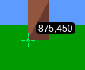
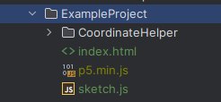
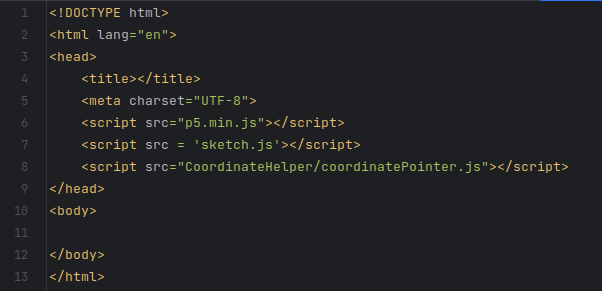
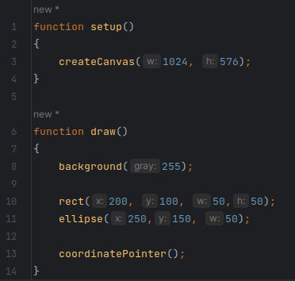
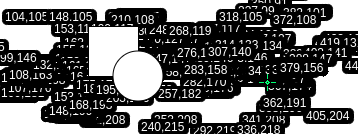

# Coordinate Helper


## How to add to your project
1) Add the 'CoordinateHelper' folder to your project in the same directory as your html file  
   (ex. *index.html*)  
     

   
2) Add this line to your html file
   
   ```html 
   <script src="CoordinateHelper/coordinatePointer.js"></script>
   ```
   

## How to use
Simply add:
```js
coordinatePointer();
```
to the end of the draw function in your sketch  
  

## How to set custom cross-hairs
1) download a cursor file you like in the .cur format
2) rename the file you downloaded to 'crossHair.cur'
3) delete or rename the existing 'crossHair.cur' file in the 'CoordinateHelper' directory
4) move the 'crossHair.cur' file you downloaded into the 'CoordinateHelper' directory
# Warning
***IF YOU DON'T HAVE A BACKGROUND SET IN THE DRAW FUNCTION YOU WILL EXPERIENCE TRAILING***  
  

### Credits
Made by: Brendan Threewitt  
Cursor file from [cursor.cc](https://www.cursor.cc/?action=icon&file_id=169484)